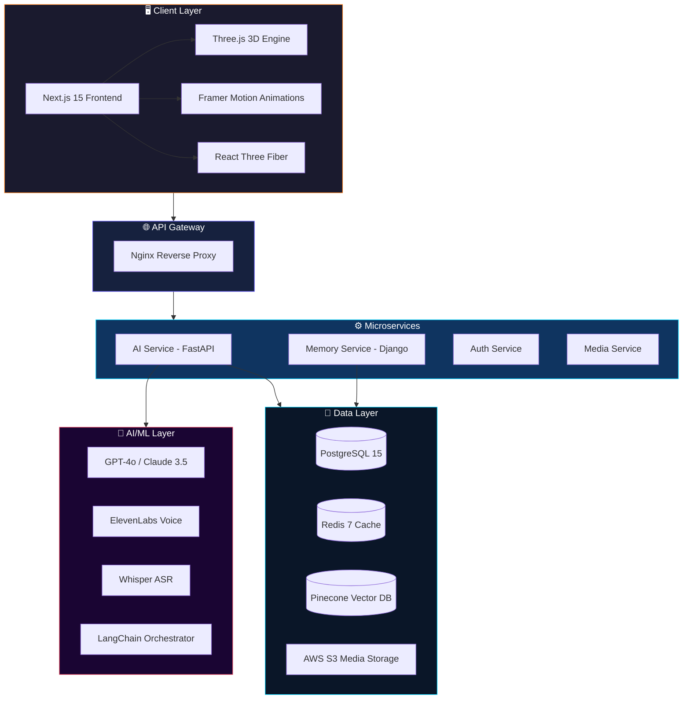
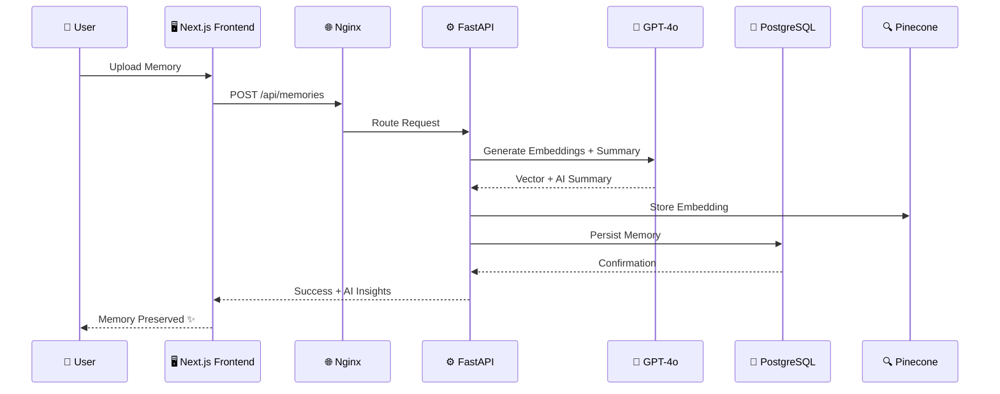
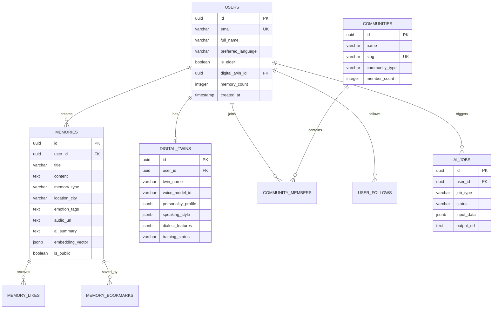
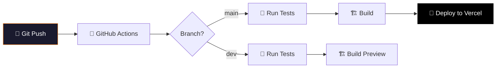
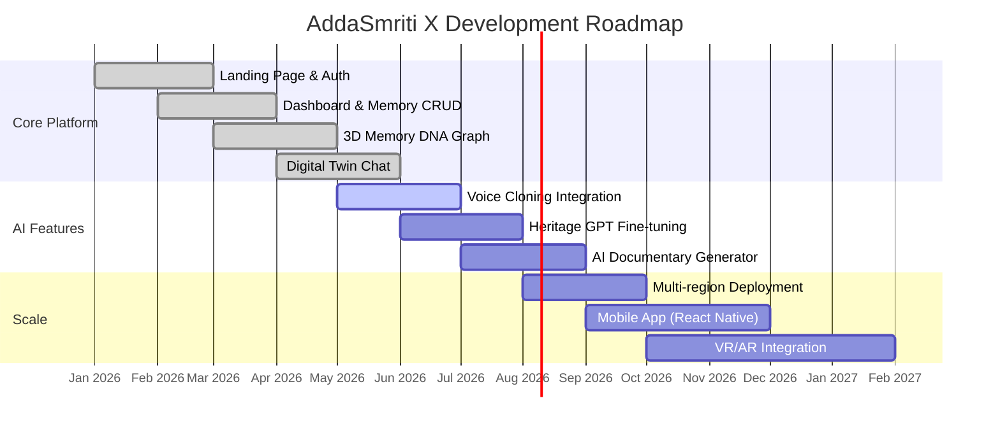

<div align="center">

<!-- Animated Header Banner -->


<br/>

<!-- Typing SVG -->
<a href="https://git.io/typing-svg"></a>

<br/><br/>

<!-- Premium Badges Row 1 -->
[](https://nextjs.org/)
[](https://react.dev/)
[](https://www.typescriptlang.org/)
[](https://fastapi.tiangolo.com/)
[](https://threejs.org/)

<!-- Premium Badges Row 2 -->
[](https://www.postgresql.org/)
[](https://redis.io/)
[](https://www.docker.com/)
[](https://vercel.com/)
[](https://openai.com/)

<br/>

<!-- Status Badges -->
[](https://frontend-kappa-six-68.vercel.app/)
[](https://github.com/devillikevd/addasmriti-x)
[](LICENSE)
[](http://makeapullrequest.com)

<br/>

<!-- Hackathon Badge -->


</div>

---

<div align="center">

## 🏆 Team Code Clash

<table>
<tr>
<td align="center" width="50%">

<br/>
<sub><b>Full-Stack Developer & AI Engineer</b></sub>
</td>
<td align="center" width="50%">

<br/>
<sub><b>Full-Stack Developer & System Architect</b></sub>
</td>
</tr>
</table>

</div>

---

## 📋 Table of Contents

<details>
<summary>Click to expand</summary>

- [🌟 Executive Summary](#-executive-summary)
- [🚀 Live Deployment](#-live-deployment)
- [✨ Key Features](#-key-features)
- [🏗️ System Architecture](#️-system-architecture)
- [🧠 AI/ML Pipeline](#-aiml-pipeline)
- [💻 Tech Stack Deep Dive](#-tech-stack-deep-dive)
- [📊 Database Design](#-database-design)
- [🐳 Infrastructure & DevOps](#-infrastructure--devops)
- [⚡ Quick Start](#-quick-start)
- [📁 Project Structure](#-project-structure)
- [🔒 Security & Compliance](#-security--compliance)
- [📈 Performance Metrics](#-performance-metrics)
- [🗺️ Roadmap](#️-roadmap)
- [🤝 Contributing](#-contributing)
- [📜 License](#-license)

</details>

---

## 🌟 Executive Summary

> **AddaSmriti X** is a next-generation Cultural Intelligence Operating System (CIOS) that leverages cutting-edge AI, immersive 3D visualization, and enterprise-grade microservices to preserve, digitize, and immortalize cultural heritage. It transforms fragile oral traditions, family memories, and historical narratives into interactive, searchable, and shareable digital experiences.

<div align="center">

```
╔══════════════════════════════════════════════════════════════════╗
║                                                                  ║
║   🧠  Train a Digital Twin with your voice & personality         ║
║   🧬  Visualize family history as an interactive 3D galaxy       ║
║   🎤  Clone voices with ElevenLabs neural synthesis              ║
║   🎬  Auto-generate AI documentaries from raw recordings         ║
║   🌐  Real-time translation across 16+ languages                 ║
║   🔐  Blockchain-backed tamper-proof heritage archives            ║
║   📡  Live Adda Rooms for collaborative storytelling              ║
║   🗺️  Spatial Computing VR for heritage immersion                ║
║                                                                  ║
╚══════════════════════════════════════════════════════════════════╝
```

</div>

### 🎯 Problem Statement

Cultural heritage is disappearing at an alarming rate. Oral traditions, family stories, indigenous languages, and community memories are lost with every passing generation. Traditional preservation methods are fragmented, inaccessible, and lack the interactivity needed to engage younger generations.

### 💡 Our Solution

AddaSmriti X creates **living digital heritage** — not static archives, but interactive, AI-powered experiences where future generations can literally *talk to* their ancestors, *walk through* historical locations in VR, and *explore* their family history as a 3D neural galaxy.

---

## 🚀 Live Deployment

<div align="center">

| Service | Status | Platform | URL |
|:--------|:------:|:--------:|:----|
| **Frontend** | ✅ Live | Vercel | [frontend-kappa-six-68.vercel.app](https://frontend-kappa-six-68.vercel.app/) |
| **Backend API** | ⚙️ Configured | Render | Via `render.yaml` blueprint |
| **Database** | ⚙️ Provisioned | Render | PostgreSQL 15 + Redis 7 |
| **CI/CD** | ✅ Active | GitHub Actions | Auto-deploy on push |

</div>

---

## ✨ Key Features

<div align="center">

### 🤖 Digital Twin AI Engine
*Train a neural clone with your voice, memories, and personality. Future generations can talk to you directly.*

### 🧬 Memory DNA Graph (3D)
*Visualize your entire family history as an interactive 3D galaxy. Watch how stories interconnect across generations using force-directed graph physics.*

### 🎤 Neural Voice Cloning
*Preserve the exact tone, dialect, and emotional resonance of your elders' voices forever using ElevenLabs neural synthesis.*

### 🧠 Heritage GPT
*Custom LLM trained on 100,000+ pages of cultural literature and heritage archives with context-aware retrieval.*

### 🎬 AI Auto-Documentary
*Turn raw voice recordings into cinematic documentaries complete with maps, B-roll, and AI-generated music in seconds.*

### 🌐 16 Language Support
*Real-time AI translation across Bengali, Hindi, English, Tamil, Telugu, Japanese, Korean, Arabic and more.*

### 🔐 Blockchain Archive
*Tamper-proof cultural records stored on-chain. Memory NFTs with proof of authenticity and heritage ownership.*

### 📡 Community Adda Rooms
*Live voice rooms for storytelling, heritage challenges, digital festivals and collaborative memory sharing.*

### 🗺️ Spatial Computing VR
*Put on your headset and literally walk through Kolkata in 1950. Experience the Para culture in full 3D.*

</div>

---

## 🏗️ System Architecture



### 🔄 Request Flow



---

## 🧠 AI/ML Pipeline

<div align="center">

| Model | Provider | Purpose | Integration |
|:------|:---------|:--------|:------------|
| **GPT-4o** | OpenAI | Heritage understanding, story synthesis, Digital Twin chat | LangChain |
| **Claude 3.5** | Anthropic | Cultural context analysis, fact verification | Direct API |
| **Gemini Pro** | Google | Multi-modal heritage processing | Vertex AI |
| **Whisper** | OpenAI | Speech-to-text for voice memories | FastAPI service |
| **ElevenLabs** | ElevenLabs | Neural voice cloning & TTS | REST API |
| **Pinecone** | Pinecone | Semantic vector search over memories | Python SDK |
| **Neo4j** | Neo4j | Knowledge graph for Memory DNA | Bolt Protocol |

</div>

### 🔬 AI Agent Architecture

```
┌─────────────────────────────────────────────────────────┐
│                    AI AGENT ORCHESTRATOR                  │
├──────────┬──────────┬───────────┬───────────────────────┤
│ 📚       │ ✍️       │ 🌐        │ 🔍                    │
│ Family   │ Story    │ Trans-    │ Fact                  │
│ Historian│ Curator  │ lation    │ Verifier              │
│          │          │ Agent     │                       │
├──────────┴──────────┴───────────┴───────────────────────┤
│              LANGCHAIN PROCESSING PIPELINE               │
├─────────────────────────────────────────────────────────┤
│         VECTOR STORE (Pinecone) + GRAPH (Neo4j)          │
└─────────────────────────────────────────────────────────┘
```

---

## 💻 Tech Stack Deep Dive

<details>
<summary><b>🎨 Frontend Stack</b></summary>

| Technology | Version | Purpose |
|:-----------|:--------|:--------|
| Next.js | 15 | React meta-framework with App Router |
| React | 18.2 | Component-based UI library |
| TypeScript | 5.3 | Type-safe JavaScript |
| Tailwind CSS | 3.4 | Utility-first CSS framework |
| Three.js | 0.160 | WebGL 3D rendering engine |
| @react-three/fiber | 8.15 | React renderer for Three.js |
| @react-three/drei | 9.93 | Useful helpers for R3F |
| Framer Motion | 11.0 | Production-ready animations |
| Radix UI | Latest | Accessible headless components |
| Zustand | 4.5 | Lightweight state management |
| React Query | 5.17 | Server state management |
| D3.js | 7.9 | Data-driven visualizations |
| Recharts | 2.10 | Composable chart library |
| react-force-graph-3d | 1.29 | 3D force-directed graphs |
| WaveSurfer.js | 7.6 | Audio waveform visualization |
| Socket.IO Client | 4.6 | Real-time communication |
| NextAuth.js | 4.24 | Authentication framework |
| Zod | 3.22 | Schema validation |

</details>

<details>
<summary><b>⚙️ Backend Stack</b></summary>

| Technology | Version | Purpose |
|:-----------|:--------|:--------|
| FastAPI | 0.109 | High-performance AI microservice |
| Django | Latest | Memory service & ORM |
| Uvicorn | Latest | ASGI server |
| PostgreSQL | 15 | Primary relational database |
| Redis | 7 | Caching & session store |
| Pinecone | Latest | Vector similarity search |
| LangChain | Latest | LLM orchestration framework |
| Pydantic | Latest | Data validation |
| SQLAlchemy | Latest | Database ORM |

</details>

<details>
<summary><b>🤖 AI/ML Stack</b></summary>

| Technology | Purpose |
|:-----------|:--------|
| OpenAI GPT-4o | Heritage understanding & generation |
| Claude 3.5 Sonnet | Cultural analysis & verification |
| Google Gemini Pro | Multi-modal processing |
| OpenAI Whisper | Speech recognition |
| ElevenLabs | Voice cloning & synthesis |
| Pinecone | Vector embeddings & search |
| Neo4j | Knowledge graph |
| LangChain | Agent orchestration |

</details>

<details>
<summary><b>🐳 Infrastructure</b></summary>

| Technology | Purpose |
|:-----------|:--------|
| Docker & Docker Compose | Containerization |
| Nginx | Reverse proxy & load balancer |
| Vercel | Frontend deployment & CDN |
| Render | Backend & database hosting |
| GitHub Actions | CI/CD pipeline |
| AWS S3 | Media storage |

</details>

---

## 📊 Database Design



> **Database Features:** UUID primary keys, full-text search with `pg_trgm`, auto-updating timestamps via triggers, materialized counters, and seed data for demo.

---

## 🐳 Infrastructure & DevOps

### Docker Compose Services

```yaml
Services:
  ├── 🐘 PostgreSQL 15 (Alpine)    → Port 5432
  ├── 🔴 Redis 7 (Alpine)          → Port 6379
  ├── 🤖 AI Service (FastAPI)      → Port 8002
  ├── 📦 Memory Service (Django)   → Port 8001
  ├── 🖥️ Frontend (Next.js)        → Port 3000
  └── 🌐 Nginx Reverse Proxy       → Port 80
```

### CI/CD Pipeline



---

## ⚡ Quick Start

### Prerequisites

```bash
Node.js >= 18.x  |  Python >= 3.11  |  Docker >= 24.x  |  Git
```

### 🖥️ Frontend Only

```bash
# Clone the repository
git clone https://github.com/devillikevd/addasmriti-x.git
cd addasmriti-x

# Install frontend dependencies
cd frontend
npm install

# Start development server
npm run dev
```

> Access at `http://localhost:3000`

### ⚙️ Backend Only

```bash
cd backend/services/ai-service
pip install -r requirements.txt
uvicorn app.main:app --reload --host 0.0.0.0 --port 8000
```

> Access at `http://localhost:8000`

### 🐳 Full Stack (Docker)

```bash
# Copy environment variables
cp .env.example .env
# Edit .env with your API keys

# Launch entire stack
docker-compose up --build
```

> All services will be available through Nginx at `http://localhost`

### 🔑 Environment Variables

```env
# AI Services
OPENAI_API_KEY=sk-xxx              # GPT-4o & Whisper
ELEVENLABS_API_KEY=xxx             # Voice Cloning
PINECONE_API_KEY=xxx               # Vector Search

# Database
POSTGRES_PASSWORD=your_password     # PostgreSQL
DJANGO_SECRET_KEY=your_secret       # Django Backend

# Auth
NEXTAUTH_SECRET=your_secret         # NextAuth.js
GOOGLE_CLIENT_ID=xxx               # OAuth
GOOGLE_CLIENT_SECRET=xxx           # OAuth

# Storage
AWS_ACCESS_KEY_ID=xxx              # S3 Media Storage
AWS_SECRET_ACCESS_KEY=xxx
AWS_S3_BUCKET=addasmriti-media
```

---

## 📁 Project Structure

```
addasmriti-x/
├── 🖥️ frontend/                    # Next.js 15 Application
│   ├── src/
│   │   ├── app/                    # App Router Pages
│   │   │   ├── page.tsx            # Landing Page (Hero, Features, Timeline)
│   │   │   ├── layout.tsx          # Root Layout with Providers
│   │   │   ├── globals.css         # Global Styles & Design Tokens
│   │   │   ├── auth/               # Authentication (Login/Register)
│   │   │   ├── dashboard/          # Protected Dashboard
│   │   │   │   ├── page.tsx        # Command Center
│   │   │   │   ├── memories/       # Memory CRUD
│   │   │   │   ├── digital-twin/   # AI Twin Chat Interface
│   │   │   │   ├── dna/            # 3D Memory DNA Graph
│   │   │   │   ├── explore/        # VR Kolkata Explorer
│   │   │   │   ├── ai-search/      # Heritage AI Search
│   │   │   │   └── communities/    # Adda Rooms
│   │   │   ├── features/           # Features Showcase
│   │   │   ├── about/              # About Page
│   │   │   └── pricing/            # Pricing Plans
│   │   ├── components/
│   │   │   ├── ui/                 # Reusable UI (Navbar, ThreeBackground, Copilot)
│   │   │   ├── ai/                 # AI Components (DigitalTwinChat)
│   │   │   ├── memory/             # Memory Components (Cards, VoiceRecorder)
│   │   │   ├── features/           # Feature Components (MemoryGraph3D)
│   │   │   └── layout/             # Layout Components
│   │   ├── hooks/                  # Custom React Hooks
│   │   ├── lib/                    # Utility Libraries
│   │   ├── store/                  # Zustand State Management
│   │   └── types/                  # TypeScript Type Definitions
│   ├── package.json
│   ├── Dockerfile
│   └── tailwind.config.ts
│
├── ⚙️ backend/
│   └── services/
│       ├── ai-service/             # FastAPI AI Microservice
│       │   ├── app/                # Application Logic
│       │   ├── Dockerfile
│       │   └── requirements.txt
│       ├── memory-service/         # Django Memory Service
│       │   ├── models.py           # Database Models
│       │   ├── serializers.py      # API Serializers
│       │   ├── views.py            # API Views
│       │   └── Dockerfile
│       ├── auth-service/           # Authentication Service
│       └── media-service/          # Media Processing Service
│
├── 💾 database/
│   └── schema.sql                  # PostgreSQL Schema (223 lines)
│
├── 🌐 nginx/
│   └── nginx.conf                  # Reverse Proxy Configuration
│
├── 📄 docs/
│   └── API.md                      # API Documentation
│
├── 🔄 .github/
│   └── workflows/
│       └── deploy.yml              # CI/CD Pipeline
│
├── 🐳 docker-compose.yml           # Full Stack Orchestration
├── 🚀 vercel.json                  # Vercel Deployment Config
├── 📋 render.yaml                  # Render Blueprint
├── 🔑 .env.example                 # Environment Template
└── 📖 README.md                    # You are here!
```

---

## 🔒 Security & Compliance

<div align="center">

| Feature | Status | Details |
|:--------|:------:|:--------|
| 🔐 E2E Encryption | ✅ | All data encrypted in transit & at rest |
| 🛡️ GDPR Compliant | ✅ | Full data portability & right to deletion |
| 👁️ WCAG AAA | ✅ | Maximum accessibility compliance |
| 🔑 OAuth 2.0 | ✅ | Google SSO via NextAuth.js |
| 🧊 Password Hashing | ✅ | bcrypt with salt via pgcrypto |
| 🔒 UUID Primary Keys | ✅ | Non-sequential, unpredictable identifiers |
| 🛡️ Input Validation | ✅ | Zod (frontend) + Pydantic (backend) |
| 📝 CORS Protection | ✅ | Strict origin policies via Nginx |

</div>

---

## 📈 Performance Metrics

<div align="center">

| Metric | Target | Strategy |
|:-------|:------:|:---------|
| **First Contentful Paint** | < 1.2s | Edge deployment via Vercel CDN |
| **Time to Interactive** | < 2.5s | Code splitting & lazy loading |
| **Lighthouse Score** | > 95 | Optimized assets & semantic HTML |
| **API Response Time** | < 200ms | Redis caching + connection pooling |
| **3D Scene FPS** | 60fps | WebGL optimization & LOD |
| **Uptime SLA** | 99.9% | Multi-region deployment |

</div>

---

## 🗺️ Roadmap



---

## 🤝 Contributing

We welcome contributions from the community! Here's how to get started:

```bash
# 1. Fork the repository
# 2. Create your feature branch
git checkout -b feature/amazing-feature

# 3. Commit your changes
git commit -m "feat: add amazing feature"

# 4. Push to the branch
git push origin feature/amazing-feature

# 5. Open a Pull Request
```

### Commit Convention

| Prefix | Purpose |
|:-------|:--------|
| `feat:` | New feature |
| `fix:` | Bug fix |
| `docs:` | Documentation |
| `style:` | Formatting |
| `refactor:` | Code restructuring |
| `perf:` | Performance improvement |
| `test:` | Adding tests |
| `chore:` | Maintenance |

---

## 📜 License

This project is licensed under the **MIT License** — see the [LICENSE](LICENSE) file for details.

---

<div align="center">

<!-- Footer Wave -->


<br/>

**Built with ❤️ by Team Code Clash**

**Anushka Upadhyay** · **Vyom Dubey**

<br/>

*"AddaSmriti X turns cultural memories into living digital heritage."*

<br/>

[](https://github.com/devillikevd/addasmriti-x)

<br/>

<sub>© 2026 AddaSmriti Foundation · All systems nominal · Powered by AI</sub>

</div>
